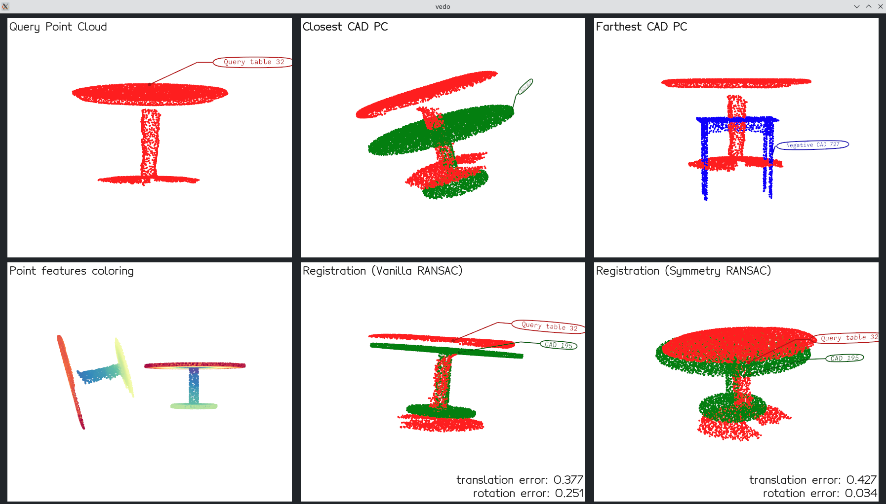

CORSAIR
=======

Code repository for
the
paper [CORSAIR: Convolutional Object Retrieval and Symmetry-AIded Registration](https://ieeexplore.ieee.org/document/9636347).

# Cite

```bibtex
@INPROCEEDINGS{CORSAIR,
    author = {Zhao, Tianyu and Feng, Qiaojun and Jadhav, Sai and Atanasov, Nikolay},
    booktitle = {IEEE/RSJ International Conference on Intelligent Robots and Systems (IROS)},
    title = {{CORSAIR: Convolutional Object Retrieval and Symmetry-AIded Registration}},
    year = {2021},
    pages = {47-54},
    doi = {10.1109/IROS51168.2021.9636347}
}
```

# Setup

## Docker Environment

```shell
git clone --recursive --branch main https://github.com/ExistentialRobotics/CORSAIR.git
cd CORSAIR/docker

# install docker and nvidia-container-toolkit if not installed
./install_docker_ubuntu.bash 
reboot # reboot the system to apply the changes

./build.bash # builds the docker image
./run.bash #runs the docker image for category chair by default
ENTRYPOINT="/home/user/CORSAIR/entrypoint_table.bash" ./run.bash #runs the docker image for category table
```

## Python Environment

```shell
git clone --recursive --branch main https://github.com/ExistentialRobotics/CORSAIR.git
pipenv lock --verbose
pipenv sync --verbose
pipenv shell
cd deps/MinkowskiEngine  # 0.5.5
pip install . --verbose
```

### Troubleshooting: mismatched CUDA version

The `PyTorch` and `CUDA` versions should match otherwise the installation of `MinkowskiEngine` will fail. To install
older versions of `CUDA` compatible with `PyTorch`, here is an example showing how to install `CUDA 12.1`
for `PyTorch 2.3` on `Arch Linux`:
```shell
wget https://developer.download.nvidia.com/compute/cuda/12.1.0/local_installers/cuda_12.1.0_530.30.02_linux.run
chmod +x cuda_12.1.0_530.30.02_linux.run
sudo ./cuda_12.1.0_530.30.02_linux.run --toolkitpath=/opt/cuda-12.1 --toolkit --override
paru -S gcc12 gcc12-libs  # Max GCC version supported by CUDA 12.1
```

Then, install `MinokowskiEngine` with the following command:
```shell
CC=gcc-12 CXX=g++-12 CUDA_HOME=/opt/cuda-12.1 pip install . --verbose
```

## Demo Data

- Download ShapeNetCore.v2.PC15k
  from [here](https://drive.google.com/file/d/1myIBzh8_Ja5gXoz6MiSAaZWXe4BQ68yB/view?usp=sharing) and extract it
  to `data/ShapeNetCore.v2.PC15k`.
- Download pre-processed Scan2CAD data
  from [here](https://drive.google.com/file/d/13My4wm3hi4pe-DxLcjuIpvA__U4PM1fq/view?usp=sharing) and extract it
  to `data/Scan2CAD_pc`.
- Download Scan2CAD annotation data
  from [here](https://drive.google.com/file/d/1zPajN8FyOJtdLNdam_Dtw9SHmq5GaVs9/view?usp=sharing) and extract it
  to `data/Scan2CAD_annotations`.

# Usage

```text
Evaluate CORSAIR

options:
  -h, --help            show this help message and exit
  --shapenet-pc15k-root SHAPENET_PC15K_ROOT
                        Path to ShapeNetCore.v2.PC15k
  --scan2cad-pc-root SCAN2CAD_PC_ROOT
                        Path to Scan2CAD
  --scan2cad-annotation-root SCAN2CAD_ANNOTATION_ROOT
                        Path to Scan2CAD annotations
  --category {table,chair}
                        Category to evaluate
  --checkpoint CHECKPOINT
                        Path to the checkpoint
  --cache-dir CACHE_DIR
                        Path to load / save the result of registration.
  --register-gt         Registering gt CAD model
  --device {cuda,cpu}   Device to use for evaluation
  --ignore-cache        Ignore cached results
```

For example,

```shell
python evaluation.py --shapenet-pc15k-root data/ShapeNetCore.v2.PC15k --scan2cad-pc-root data/Scan2CAD_pc --scan2cad-annotation-root data/Scan2CAD_annotations --category chair --checkpoint ckpts/scannet_pose_chair_best --cache-dir data/cache_pose_best --register-gt --device cuda
```

will evaluate the model on the chair category and register the ground-truth CAD model using the GPU.



- Press Left/Right to navigate through the results.
- Drag the mouse to rotate the object.

**Note: the `Predicted Closest CAD PC` may not align with the query point cloud well when the matching point cloud is
not the ground truth.**

# Metrics

**Note: the numbers of `Top1-Prediction` tend to be lower because the predicted CAD model may not be the ground-truth
match, making the relative pose estimate less accurate.**

## Retrival

|       Checkpoint        | Precision@10% | Top1-CD  |
|:-----------------------:|:-------------:|:--------:|
| scannet_pose_chair_best |    22.55%     |   0.17   |
|   scannet_pose_chair    |    22.71%     |   0.17   |
| scannet_ret_chair_best  |    31.27%     |   0.15   |
|  **scannet_ret_chair**  |  **31.30%**   | **0.15** |

|         Checkpoint         | Precision@10% | Top1-CD  |
|:--------------------------:|:-------------:|:--------:|
|  scannet_pose_table_best   |    31.89%     |   0.22   |
|     scannet_pose_table     |    31.70%     |   0.22   |
| **scannet_ret_table_bset** |  **41.13%**   | **0.19** |
|     scannet_ret_table      |    41.05%     |   0.19   |

## Registration

- RRE: relative rotation error

|       Checkpoint        | Registration Target | Sym. |        Mean RRE        | RRE $\le 5^\circ$ | RRE $\le 15^\circ$ | RRE $\le 45^\circ$ |
|:-----------------------:|:-------------------:|:----:|:----------------------:|:-----------------:|:------------------:|:------------------:|
| scannet_pose_chair_best |   Top1-Prediction   |  N   |     $39.17^\circ$      |       6.64%       |       54.78%       |       80.36%       |
|                         |                     |  Y   |     $38.74^\circ$      |       9.87%       |       59.82%       |       81.17%       |
|                         |    G.T. Matching    |  N   |     $21.23^\circ$      |      12.69%       |       75.33%       |     **92.15%**     |
|                         |                     |  Y   |     $21.25^\circ$      |    **20.24%**     |       80.87%       |       91.54%       |
|   scannet_pose_chair    |   Top1-Prediction   |  N   |     $38.84^\circ$      |       8.06%       |       54.98%       |       79.46%       |
|                         |                     |  Y   |     $39.85^\circ$      |       9.77%       |       59.82%       |       79.56%       |
|                         |    G.T. Matching    |  N   |     $22.34^\circ$      |      13.39%       |       73.11%       |       91.64%       |
|                         |                     |  Y   |     $21.00^\circ$      |      19.54%       |       79.15%       |       91.84%       |
| scannet_ret_chair_best  |   Top1-Prediction   |  N   |     $33.68^\circ$      |       7.96%       |       60.12%       |       83.79%       |
|                         |                     |  Y   |     $33.95^\circ$      |    **10.98%**     |       66.26%       |       83.38%       |
|                         |    G.T. Matching    |  N   |     $22.32^\circ$      |      13.19%       |       74.62%       |       91.64%       |
|                         |                     |  Y   |     $20.73^\circ$      |      19.54%       |       80.26%       |       92.04%       |
|  **scannet_ret_chair**  |   Top1-Prediction   |  N   | $\mathbf{31.83^\circ}$ |       8.26%       |       64.65%       |     **84.49%**     |
|                         |                     |  Y   |     $32.78^\circ$      |      10.78%       |     **68.38%**     |       84.19%       |
|                         |    G.T. Matching    |  N   |     $22.29^\circ$      |      13.39%       |       74.92%       |       91.14%       |
|                         |                     |  Y   | $\mathbf{20.53^\circ}$ |      19.33%       |     **81.77%**     |       91.54%       |

|         Checkpoint         | Registration Target | Sym. |        Mean RRE        | RRE $\le 5^\circ$ | RRE $\le 15^\circ$ | RRE $\le 45^\circ$ |
|:--------------------------:|:-------------------:|:----:|:----------------------:|:-----------------:|:------------------:|:------------------:|
|  scannet_pose_table_best   |   Top1-Prediction   |  N   |     $56.60^\circ$      |      11.68%       |       42.61%       |       59.79%       |
|                            |                     |  Y   | $\mathbf{54.99^\circ}$ |      22.33%       |       50.52%       |       61.51%       |
|                            |    G.T. Matching    |  N   |     $42.73^\circ$      |      18.21%       |       59.11%       |       74.57%       |
|                            |                     |  Y   |     $38.54^\circ$      |      33.33%       |       69.41%       |       76.98%       |
|     scannet_pose_table     |   Top1-Prediction   |  N   |     $64.17^\circ$      |      13.40%       |       42.27%       |       56.01%       |
|                            |                     |  Y   |     $61.31^\circ$      |    **22.68%**     |       47.42%       |       58.08%       |
|                            |    G.T. Matching    |  N   |     $39.45^\circ$      |      21.31%       |       62.89%       |       76.29%       |
|                            |                     |  Y   |     $40.08^\circ$      |      35.05%       |       70.45%       |       75.60%       |
| **scannet_ret_table_best** |   Top1-Prediction   |  N   |     $62.13^\circ$      |      13.40%       |       44.33%       |       58.42%       |
|                            |                     |  Y   |     $56.28^\circ$      |      21.65%       |     **51.55%**     |     **61.86%**     |
|                            |    G.T. Matching    |  N   |     $42.99^\circ$      |      20.27%       |       62.89%       |       73.88%       |
|                            |                     |  Y   | $\mathbf{36.11^\circ}$ |    **39.52%**     |     **73.88%**     |     **78.01%**     |
|     scannet_ret_table      |   Top1-Prediction   |  N   |     $66.43^\circ$      |      11.34%       |       36.77%       |       54.30%       |
|                            |                     |  Y   |     $64.34^\circ$      |      20.27%       |       45.02%       |       57.04%       |
|                            |    G.T. Matching    |  N   |     $45.52^\circ$      |      20.27%       |       62.89%       |       73.54%       |
|                            |                     |  Y   |     $42.24^\circ$      |      35.05%       |       70.10%       |       74.57%       |

- RTE: relative translation error

|       Checkpoint        | Registration Target | Sym. | Mean RTE | RTE $\le 0.02$ | RTE $\le 0.05$ | RTE $\le 0.10$ | RTE $\le 0.15$ |
|:-----------------------:|:-------------------:|:----:|:--------:|:--------------:|:--------------:|:--------------:|:--------------:|
| scannet_pose_chair_best |   Top1-Prediction   |  N   |   0.28   |     0.20%      |     3.93%      |     20.95%     |     43.61%     |
|                         |                     |  Y   |   0.27   |     0.30%      |     4.53%      |     23.36%     |     47.33%     |
|                         |    G.T. Matching    |  N   |   0.15   |     1.31%      |     13.70%     |     49.35%     |     73.21%     |
|                         |                     |  Y   |   0.15   |     1.61%      |     17.52%     |     58.01%     |     78.15%     |
|   scannet_pose_chair    |   Top1-Prediction   |  N   |   0.28   |     0.30%      |     4.73%      |     22.86%     |     43.00%     |
|                         |                     |  Y   |   0.27   |     0.30%      |     4.83%      |     24.37%     |     45.02%     |
|                         |    G.T. Matching    |  N   |   0.16   |     1.10%      |     13.19%     |     46.83%     |     73.41%     |
|                         |                     |  Y   |   0.15   |   **1.61%**    |   **18.12%**   |     56.60%     |     78.05%     |
| scannet_ret_chair_best  |   Top1-Prediction   |  N   |   0.25   |     0.30%      |     4.33%      |     26.38%     |     47.23%     |
|                         |                     |  Y   |   0.24   |   **0.50%**    |     6.24%      |     29.90%     |     51.56%     |
|                         |    G.T. Matching    |  N   |   0.16   |     1.21%      |     11.78%     |     47.63%     |     72.21%     |
|                         |                     |  Y   |   0.15   |     2.01%      |     18.03%     |     55.39%     |     78.75%     |
|  **scannet_ret_chair**  |   Top1-Prediction   |  N   |   0.23   |     0.40%      |     6.64%      |     29.00%     |     53.47%     |
|                         |                     |  Y   | **0.23** |     0.30%      |   **7.96%**    |   **33.94%**   |   **56.90%**   |
|                         |    G.T. Matching    |  N   |   0.16   |     1.11%      |     13.60%     |     49.85%     |     74.22%     |
|                         |                     |  Y   | **0.15** |     1.41%      |     16.92%     |   **57.00%**   |   **79.25%**   |

|         Checkpoint         | Registration Target | Sym. | Mean RTE | RTE $\le 0.02$ | RTE $\le 0.05$ | RTE $\le 0.10$ | RTE $\le 0.15$ |
|:--------------------------:|:-------------------:|:----:|:--------:|:--------------:|:--------------:|:--------------:|:--------------:|
|  scannet_pose_table_best   |   Top1-Prediction   |  N   |   0.35   |     0.34%      |     5.15%      |     21.31%     |     35.40%     |
|                            |                     |  Y   | **0.34** |   **1.37%**    |     5.84%      |     23.37%     |     37.46%     |
|                            |    G.T. Matching    |  N   |   0.28   |     2.41%      |     12.71%     |     39.86%     |     56.01%     |
|                            |                     |  Y   |   0.24   |     3.78%      |     25.77%     |     56.01%     |     67.70%     |
|     scannet_pose_table     |   Top1-Prediction   |  N   |   0.39   |     0.69%      |     5.84%      |     18.90%     |     30.24%     |
|                            |                     |  Y   |   0.38   |     0.69%      |     6.19%      |     21.31%     |   **38.14%**   |
|                            |    G.T. Matching    |  N   |   0.25   |     1.72%      |     13.06%     |     40.21%     |     59.79%     |
|                            |                     |  Y   | **0.23** |     2.06%      |     25.77%     |     53.61%     |     67.70%     |
| **scannet_ret_table_best** |   Top1-Prediction   |  N   |   0.37   |     0.34%      |     4.81%      |     20.27%     |     33.33%     |
|                            |                     |  Y   |   0.36   |     0.34%      |   **8.25%**    |   **27.15%**   |     37.46%     |
|                            |    G.T. Matching    |  N   |   0.27   |     1.37%      |     14.09%     |     41.24%     |     58.42%     |
|                            |                     |  Y   |   0.22   |     3.09%      |   **28.18%**   |   **56.70%**   |   **73.20%**   |
|     scannet_ret_table      |   Top1-Prediction   |  N   |   0.40   |     0.34%      |     4.81%      |     16.49%     |     28.18%     |
|                            |                     |  Y   |   0.39   |     0.00%      |     6.19%      |     20.27%     |     34.36%     |
|                            |    G.T. Matching    |  N   |   0.27   |     0.34%      |     11.68%     |     41.24%     |     61.17%     |
|                            |                     |  Y   |   0.25   |   **4.12%**    |     23.02%     |     54.30%     |     68.38%     |

The above registration results are affected by the quality of the predicted CAD model and the accuracy of the ground
truth poses. To evaluate the registration more fairly with accurate ground truth and without the affect of bad object
retrieval, please run the `evalution-shapenet.py` script. e.g.

```shell
python evaluation-shapenet.py --shapenet-root ./Data/ShapeNetCore.v2.PC15k --category chair --model-ckpt ckpts/scannet_ret_chair --n-models 100             
python evaluation-shapenet.py --shapenet-root ./Data/ShapeNetCore.v2.PC15k --category table --model-ckpt ckpts/scannet_pose_table_best --n-models 100
```

The numbers vary slightly due to the unpredictable parallelism behavior of the `Open3D` `RANSAC` algorithm.

|       Checkpoint        | Sym. | RRE $\le 5^\circ$ | RRE $\le 15^\circ$ | RRE $\le 45^\circ$ | RTE $\le 0.02$ | RTE $\le 0.05$ | RTE $\le 0.10$ | RTE $\le 0.15$ |
|:-----------------------:|:----:|:-----------------:|:------------------:|:------------------:|:--------------:|:--------------:|:--------------:|:--------------:|
|    scannet_ret_chair    |  N   |        72%        |        98%         |        99%         |      30%       |      93%       |      98%       |      100%      |
|    scannet_ret_chair    |  Y   |      **93%**      |      **100%**      |      **100%**      |    **64%**     |    **97%**     |    **100%**    |    **100%**    |
| scannet_pose_table_best |  N   |        84%        |      **99%**       |      **99%**       |      32%       |      88%       |    **100%**    |      100%      |
| scannet_pose_table_best |  Y   |      **92%**      |        98%         |        98%         |    **69%**     |    **95%**     |      99%       |    **100%**    |
